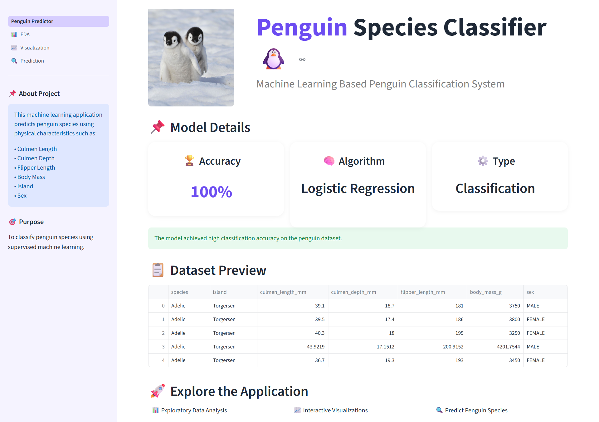
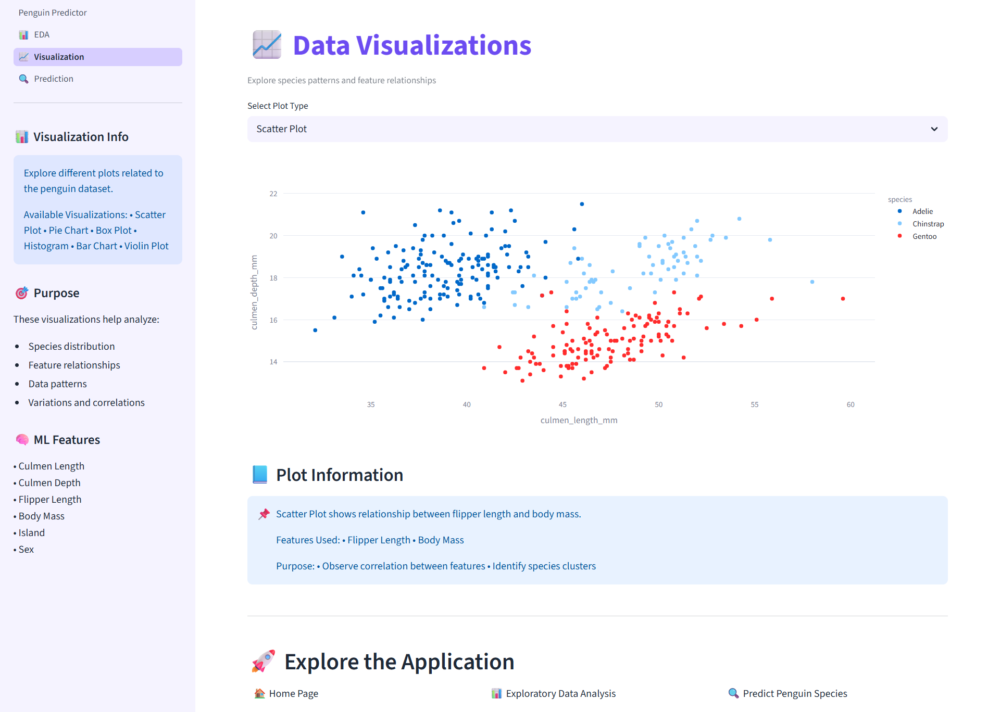
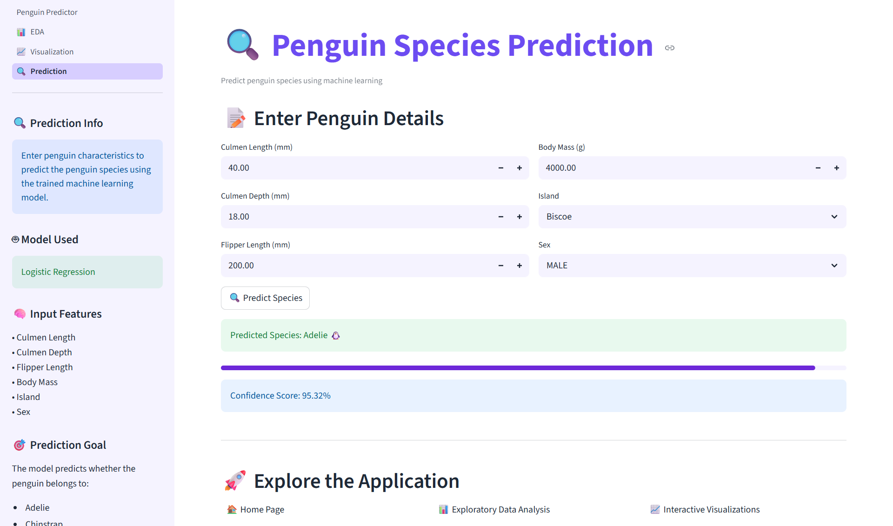

# 🐧 Penguin Classifier

A Machine Learning based classification project that predicts penguin species using physical characteristics through an interactive **Streamlit web application**.

## 🌐 Live Demo

🚀 **[Launch Penguin Classifier](https://huggingface.co/spaces/Mahek-Bagai/Penguin_Classifier)**

## 📸 Application Preview

### 🏠 Dashboard

### 📊 Data Visualizations

### 🔍 Penguin Prediction

## 📌 Overview

This project uses physical characteristics of penguins to classify them into their respective species.

The project covers the complete Machine Learning workflow:

**Data → Cleaning → Preprocessing → Encoding → Model Training → Evaluation → Streamlit Deployment**

## 🤖 Model

**Logistic Regression**

- **Type:** Classification
- **Accuracy:** 100%
- **Target:** Penguin Species

The trained model, scaler, label encoder, and feature columns are saved as serialized files and used by the Streamlit application.

## 📊 Features

- Culmen Length
- Culmen Depth
- Flipper Length
- Body Mass
- Island
- Sex

## 🐧 Dataset

The project uses the **Palmer Penguins Dataset** containing penguin measurements and categorical information.

The dataset is cleaned and preprocessed before being used for Machine Learning.

## 🛠️ Tech Stack

**Python • Pandas • NumPy • Scikit-learn • Streamlit • Matplotlib • Seaborn • Jupyter Notebook • Pillow**

## ▶️ Run Locally

    git clone https://github.com/mahekbagai-1704/penguin-classifier.git
    cd penguin-classifier
    pip install streamlit pandas numpy scikit-learn matplotlib seaborn pillow
    streamlit run Penguin_Predictor.py

## 📂 Project Structure

    penguin-classifier/
    │
    ├── Penguin_Predictor.py
    ├── penguins_size.csv
    ├── cleaned_penguins.csv
    ├── Encoded_DataSet.csv
    ├── penguin_model.pkl
    ├── scaler.pkl
    ├── label_encoder.pkl
    ├── feature_columns.pkl
    ├── penguins_size (2).ipynb
    ├── Penguin_image.jpg
    ├── pages/
    │   ├── 1_📊_EDA.py
    │   ├── 2_📈_Visualization.py
    │   └── 3_🔍_Prediction.py
    ├── screenshots/
    │   ├── Dashboard.png
    │   ├── Data_Visualizations.png
    │   └── Penguin_Prediction.png
    ├── .gitignore
    └── README.md

---

⭐ Built as part of my Data Science and Machine Learning learning journey.
